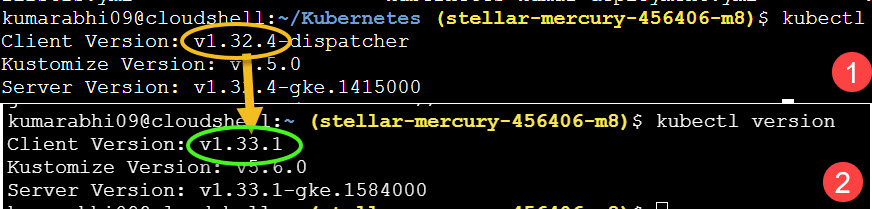

# Upgrade to Kubernetes v1.33 on GKE 🚀

This repository documents the step-by-step process of upgrading a GKE cluster from Kubernetes v1.32.4 to v1.33.1.

## 📋 Checklist
See [`gke-upgrade-checklist.yaml`](./gke-upgrade-checklist.yaml) for a declarative checklist format used for GitOps-based tracking.

## 🧪 Key Steps
- Backed up all manifests and resources
- Scanned for deprecated APIs
- Upgraded the control plane and node pool
- Validated workloads and nodes post-upgrade
- Performed smoke testing and monitoring

## 📸 Screenshots

## ✅ Completed On
**Date:** June 26, 2025  
**Cluster:** `stellar-mercury-456406-m8`  
**Location:** `us-central1-a`  
**GKE Version:** `v1.33.1-gke.1584000`
